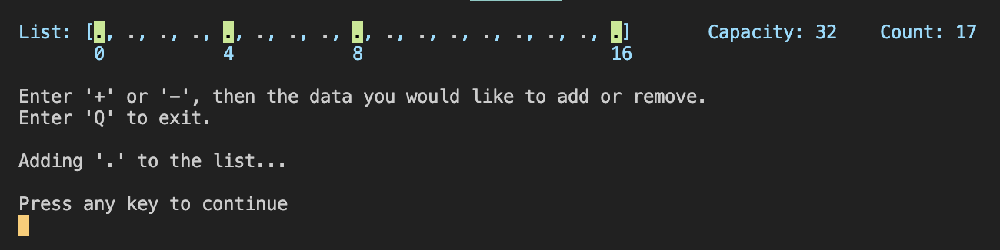
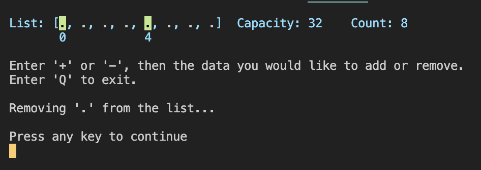

# 1. ExamineList()

This exercise looks at some behaviors of `List` and focuses on how the `Capacity` property of the underlying `Array` is effected when adding to or removing from the List.

To examine and illustrate what is happening, I implemented the ExamineList sub-routine to output a "debug" log of the List instance and highlighted each time the Capacity changed.

## Adding to the List

The initial Capacity of an empty list is 4. The `Capacity` of the underlying Array increases exponentially, doubling each time the size of the List reaches Capacity.

## Removing from the list

The Capacity remains the same after removing items from the List.

## Conclusion
(ToDo)

### References:
* [System.Collections.Generic.List<T> class](https://learn.microsoft.com/en-us/dotnet/fundamentals/runtime-libraries/system-collections-generic-list%7Bt%7D)
* [ArrayList Class](https://learn.microsoft.com/en-us/dotnet/api/system.collections.arraylist?view=net-10.0)